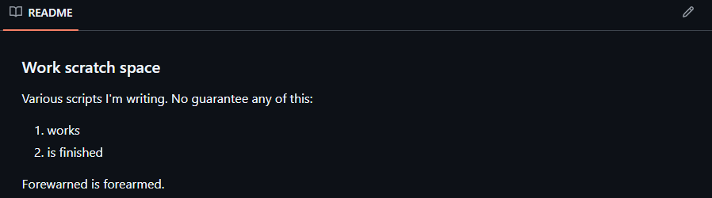
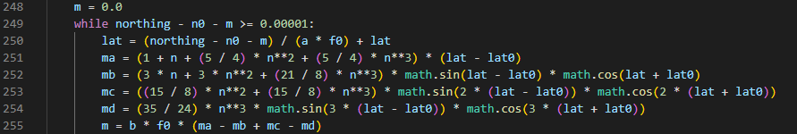
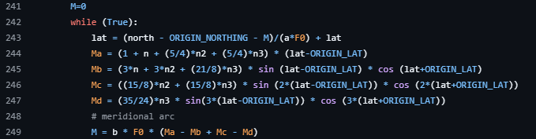
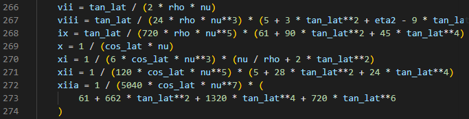
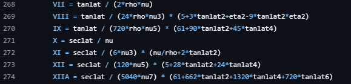

# Example AI Workflow:

#### Baseline (Human) [src/weather.py]
Simple script created by myself

Sources:
* https://osdatahub.os.uk/
* https://datahub.metoffice.gov.uk/


#### CODEX Prompt (GPT 5.3 Codex) [src/weather_codex.py]
```
Generate python code
Input UK postcode 
Output weather forcast for the postcode 
Give the change of rain that day for the next week
Append weather_codex.py, do not alter other files
Use Python3.12 best practices
```

#### Claude Prompt (Sonnet 4.6) [src/weather_claude.py]
```
Generate python code
Input UK postcode 
Output weather forcast for the postcode 
Give the change of rain that day for the next week
Append weather_claude.py, do not alter other files
Use Python3.12 best practices
```

#### CODEX Prompt (GPT 5.3 Codex) [src/weather_codex_prompt.py]
```
Generate python code
Input UK postcode 
Output weather forcast for the postcode for 7 days 
Give the change of rain that day for the next week
Append weather_codex_prompt.py, do not alter other files
Use Python3.12 best practices https://peps.python.org/pep-0008/
Use the MET Office API for weather information https://datahub.metoffice.gov.uk/
Use the OSD API for postcodes lookup https://osdatahub.os.uk/
Both API are on free tier usage
OSD coordinates will need converting to to latitude longitude for the MET office API
The API Keys are stored in .env and are not to be exposed in the main code
Usage src/weather_codex_prompt.py "<POSTCODE>"
```

#### Baseline (Human + GPT 5.3 Codex) [src/weather_improved.py]
AI used to help debug and improve the existing script. For the example error handling and debugging.

Error checking:
> * The postcode lookup validation is too strict. It currently requires fields like POPULATED_PLACE, REGION, and COUNTRY.
If OS Data Hub returns valid coordinates but one of those fields is missing, the script fails even though it could still fetch the forecast.
>
> * The forecast field handling is inconsistent. The forecast function supports a custom field name, but the print logic always reads dayProbabilityOfRain.
If the field is changed, output will show incorrect values (N/A) even when data exists.
>
> * Reused HTTP session and coordinate transformer along side some other minor improvements


# Issue 1 - Code Source:

A large part of the code output is sourced from this github repo:
https://github.com/pwcazenave/pml-git/blob/master/python/osgb.py




#### Example 1 - [en_to_lat_lon_osgb36]:
AI Output:



Github Source:



#### Example 2 - [en_to_lat_lon_osgb36]:
AI Output:



Github Source:



When a unique task is being solved using an LLM it is far more likely to generate blocks of code completely copied from training data. This can come from user inputs that the LLMs are trained on or other sources such as scraped github repositories.

# Issue 2 - Code Complexity and Maintainability:
Examples of issues:
* get_weekly_forecast() - Difficult to read and debug the API request
* format_forecast() - Convoluted print statements for output 
* en_to_lat_lon_osgb36() - Complex maths to understand and validate
* osgb36_to_wgs84() - Complex maths to understand and validate
* http_get_json() - Not needed, there are inbuilt .json functions
* Hardcoded variables such as "SIGNIFICANT_WEATHER_CODES"

The LLM regularly generates overly complex code for the solution, this code will be difficult to maintain and debug. This can be dangerous when not fully understanding the impact and reasoning of the code for its specific function.


# Timings: Average Execution Time

| Script                    | Average Execution (s)| Same API |
| ------------------------- | -------------------: |----------|
| `weather_claude.py`       |                0.349 |          |
| `weather_codex_prompt.py` |                0.490 |X         |
| `weather_codex.py`        |                0.548 |          |
| `weather_improved.py`     |                0.846 |X         |
| `weather.py`              |                0.830 |X         |

#### Timings: Raw

| Script                    | Run | Execution Time (s) |
| ------------------------- | --: | -----------------: |
| `weather_claude.py`       |   1 |              0.348 |
| `weather_claude.py`       |   2 |              0.356 |
| `weather_claude.py`       |   3 |              0.354 |
| `weather_claude.py`       |   4 |              0.334 |
| `weather_claude.py`       |   5 |              0.354 |
| `weather_codex_prompt.py` |   1 |              0.591 |
| `weather_codex_prompt.py` |   2 |              0.487 |
| `weather_codex_prompt.py` |   3 |              0.430 |
| `weather_codex_prompt.py` |   4 |              0.523 |
| `weather_codex_prompt.py` |   5 |              0.417 |
| `weather_codex.py`        |   1 |              0.552 |
| `weather_codex.py`        |   2 |              0.535 |
| `weather_codex.py`        |   3 |              0.579 |
| `weather_codex.py`        |   4 |              0.524 |
| `weather_codex.py`        |   5 |              0.551 |
| `weather_improved.py`     |   1 |              0.826 |
| `weather_improved.py`     |   2 |              0.857 |
| `weather_improved.py`     |   3 |              0.866 |
| `weather_improved.py`     |   4 |              0.831 |
| `weather_improved.py`     |   5 |              0.852 |
| `weather.py`              |   1 |              0.816 |
| `weather.py`              |   2 |              0.821 |
| `weather.py`              |   3 |              0.833 |
| `weather.py`              |   4 |              0.853 |
| `weather.py`              |   5 |              0.829 |

# Timings: Profile

Time difference due to weather.py using **requests** while weather_cpdex_prompt.py uses **urllib**.

Script Profile: weather.py:

```bash
   ncalls  tottime  percall  cumtime  percall filename:lineno(function)
        2    0.314    0.157    0.314    0.157 {method 'load_verify_locations' of '_ssl._SSLContext' objects}
        3    0.187    0.062    0.187    0.062 {method 'read' of '_ssl._SSLSocket' objects}
        2    0.063    0.032    0.063    0.032 {method 'do_handshake' of '_ssl._SSLSocket' objects}
        2    0.030    0.015    0.030    0.015 {method 'connect' of '_socket.socket' objects}
```

Script Profile: weather_codex_prompt.py:

```bash
   ncalls  tottime  percall  cumtime  percall filename:lineno(function)
        4    0.189    0.047    0.189    0.047 {method 'read' of '_ssl._SSLSocket' objects}
        2    0.069    0.034    0.069    0.034 {method 'do_handshake' of '_ssl._SSLSocket' objects}
        2    0.030    0.015    0.030    0.015 {method 'connect' of '_socket.socket' objects}
        2    0.015    0.008    0.015    0.008 {method 'load_verify_locations' of '_ssl._SSLContext' objects}
```

Profile:

```bash
python -m cProfile -o profile.out weather_codex_prompt.py "DE74 2JB" && python -c "import pstats; p=pstats.Stats('profile.out'); p.strip_dirs().sort_stats('tottime').print_stats(50)"
```